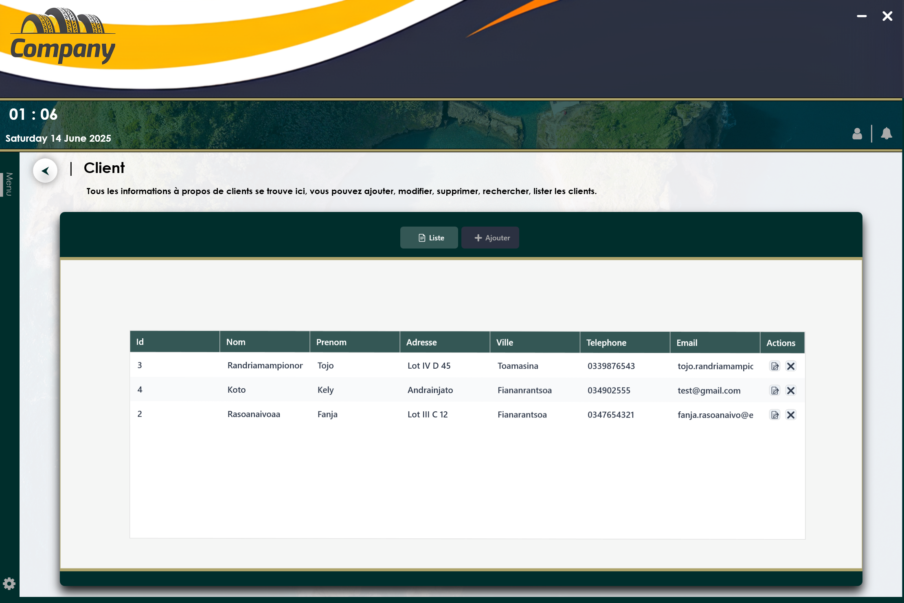

# Module CRUD Client - Application WPF

## Description
Ce module permet de gérer les clients (ajout, consultation, modification, suppression) dans une application WPF. L’interface graphique est définie dans `Client.xaml` et la logique dans `Client.xaml.cs`.

## Apercu

## Fonctionnalités

- **Lister les clients**  
  Affichage de tous les clients dans un `DataGrid` moderne avec les colonnes : Id, Nom, Prénom, Adresse, Ville, Téléphone, Email.  
  Des boutons d’action permettent de modifier (📝) ou supprimer (❌) chaque client.

- **Ajouter un client**  
  Onglet "➕ Ajouter" : formulaire pour saisir les informations d’un nouveau client.  
  Les champs obligatoires sont indiqués.  
  Cliquez sur "✔️ Enregistrer" pour valider l’ajout.

- **Modifier un client**  
  Onglet "✏️ Modifier" (visible uniquement lors de la modification) : formulaire pré-rempli pour éditer un client existant.  
  Cliquez sur "✔️ Enregistrer" pour sauvegarder les modifications.

- **Supprimer un client**  
  Dans l’onglet "Liste", cliquez sur le bouton ❌ pour supprimer un client.

- **Nettoyer les champs**  
  Utilisez le bouton 🧹 pour réinitialiser les champs du formulaire.

## Structure de l’interface

- **Onglets**  
  - 📄 Liste : liste des clients avec actions.  
  - ➕ Ajouter : formulaire d’ajout.  
  - ✏️ Modifier : formulaire de modification.

- **Design**  
  Styles personnalisés pour les boutons, champs de texte et DataGrid pour une interface moderne et agréable.

## Utilisation

1. **Ajouter un client**  
   Allez dans l’onglet "Ajouter", remplissez les champs puis cliquez sur "Enregistrer".

2. **Modifier un client**  
   Dans "Liste", cliquez sur 📝 à côté du client à modifier. L’onglet "Modifier" s’ouvre avec les informations pré-remplies. Modifiez puis enregistrez.

3. **Supprimer un client**  
   Dans "Liste", cliquez sur ❌ à côté du client à supprimer.

4. **Nettoyer les champs**  
   Cliquez sur 🧹 pour vider les champs du formulaire.

## Fichiers concernés

- `Client.xaml` : interface utilisateur (UI)
- `Client.xaml.cs` : logique métier et gestion des événements

## Prérequis

- .NET (WPF)
- Visual Studio 2022

## Notes
Le code est encore un peu brouillon.